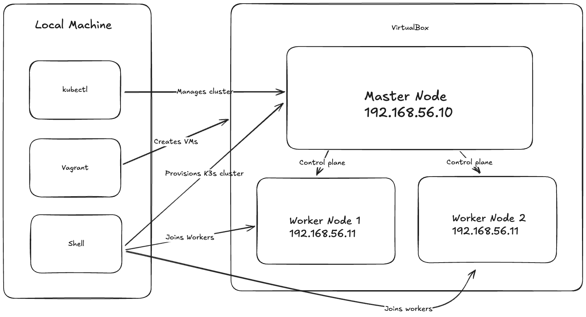

# K3s Cluster Setup with Vagrant and Ansible

This repository contains Infrastructure as Code (IaC) for setting up a K3s Kubernetes cluster using Vagrant and Ansible. The setup includes one master node and two worker nodes running on VirtualBox VMs.

## Architecture



## Prerequisites

- VirtualBox (7.1.6)
- Vagrant (2.4+)
- At least 4GB of free RAM
- Python 3.x

## System Requirements

| Node Type  | CPU | RAM  | Disk |
|------------|-----|------|------|
| Master     | 2   | 2GB  | 20GB |
| Worker     | 1   | 1GB  | 20GB |

## Project Structure

```
.
├── README.md
├── Vagrantfile  # VM configuration
├── images
│   └── K3s-virtualbox-cluster.excalidraw
├── local-setup.sh  # Script to configure local workspace
├── master-node.sh  # Master node configuration
└── worker-node.sh  # Worker node configuration
```

## Installation Steps

1. Install required software:
   ```bash
   # Ubuntu/Debian
   sudo apt update
   sudo apt install virtualbox vagrant

   # macOS
   brew install virtualbox vagrant
   ```

2. Clone this repository:
   ```bash
   git clone https://github.com/iabhee/k3s-virtualbox.git
   cd k3s-virtualbox
   ```

3. Start the cluster:
   ```bash
   vagrant up
   ```

4. Configure local workspace 
   ```bash
   ./local-setup.sh
   ```

5. Verify the installation:
   ```bash
   kubectl get nodes
   ```

## Deployment Flow

1. **VM Creation**:
   - Vagrant creates three VMs using the bento/ubuntu-20.04 base box
   - Configures network settings and resources
   - Sets up SSH access

2. **K3s Installation**:
   - master-node.sh script installs K3s on the master node
   - Retrieves the node token
   - Updates kubeconfig with correct master IP
   - Sets up environment variables
   - worker-nodes.sh script configures worker nodes with the token
   - Joins workers to the cluster

3. **Local Configuration**:
   - local-setup.sh script copies kubeconfig from master to local machine
   - Updates kubeconfig with correct master IP
   - Sets up environment variables

## Network Configuration

- Master Node: 192.168.56.10
- Worker Node 1: 192.168.56.11
- Worker Node 2: 192.168.56.12
- Network: Private network (host-only adapter)

## Common Operations

### Access the Cluster
```bash
kubectl get nodes
kubectl get pods --all-namespaces
```

### SSH into Nodes
```bash
# Master node
vagrant ssh master

# Worker nodes
vagrant ssh worker1
vagrant ssh worker2
```

### Stop the Cluster
```bash
vagrant halt
```

### Remove the Cluster
```bash
vagrant destroy -f
```

## Troubleshooting

1. **Check Status**:
   - Check status: `vagrant status`

2. **Connection Issues**:
   - Check SSH connectivity: `vagrant ssh master`

2. **Node Not Ready Status**:
   - Check K3s service: `sudo systemctl status k3s`
   - View logs: `sudo journalctl -u k3s`

4. **Network Issues**:
   - Verify VirtualBox network settings
   - Ensure no IP conflicts in your network

5. **View Logs on Master Node**:
   - vagrant ssh master -c 'journalctl -u k3s'

## Maintenance

### Updating K3s
```bash
# On master node
sudo systemctl stop k3s
curl -sfL https://get.k3s.io | sh -

# On worker nodes
sudo systemctl stop k3s-agent
curl -sfL https://get.k3s.io | sh -
```

### Backup etcd
```bash
sudo k3s etcd-snapshot save
```

## Security Considerations

- Default configuration uses HTTP instead of HTTPS
- Development/testing setup - not recommended for production
- Uses default K3s configuration
- Lacks authentication mechanisms

## Contributing

1. Fork the repository
2. Create a feature branch
3. Commit changes
4. Push to the branch
5. Create a Pull Request

## License

This project is licensed under the MIT License - see the LICENSE file for details.